R Project Day Spring 2018
================
Jun Seo Park
April 14, 2018

``` r
# install.packages('tidyverse')
library(ggplot2)
library(dplyr)
```

    ## 
    ## Attaching package: 'dplyr'

    ## The following objects are masked from 'package:stats':
    ## 
    ##     filter, lag

    ## The following objects are masked from 'package:base':
    ## 
    ##     intersect, setdiff, setequal, union

``` r
station <- read.csv('GoBike_data/station.csv')
trip <- read.csv('GoBike_data/trip.csv')
str(trip)
```

    ## 'data.frame':    669959 obs. of  11 variables:
    ##  $ id                : int  4576 4607 4130 4251 4299 4927 4500 4563 4760 4258 ...
    ##  $ duration          : int  63 70 71 77 83 103 109 111 113 114 ...
    ##  $ start_date        : Factor w/ 361559 levels "1/1/2014 0:14",..: 319540 319554 319399 319421 319440 319711 319505 319534 319632 319425 ...
    ##  $ start_station_name: Factor w/ 74 levels "2nd at Folsom",..: 64 53 35 53 64 23 60 59 64 53 ...
    ##  $ start_station_id  : int  66 10 27 10 66 59 4 8 66 10 ...
    ##  $ end_date          : Factor w/ 357757 levels "1/1/2014 0:21",..: 316458 316474 316342 316358 316370 316631 316429 316452 316554 316359 ...
    ##  $ end_station_name  : Factor w/ 74 levels "2nd at Folsom",..: 64 53 35 53 28 23 5 59 64 33 ...
    ##  $ end_station_id    : int  66 10 27 10 67 59 5 8 66 11 ...
    ##  $ bike_id           : int  520 661 48 26 319 527 679 687 553 107 ...
    ##  $ subscription_type : Factor w/ 2 levels "Customer","Subscriber": 2 2 2 2 2 2 2 2 2 2 ...
    ##  $ zip_code          : Factor w/ 7440 levels "","0","1","100",..: 6452 6803 7145 6752 6419 6429 6776 6776 6419 6752 ...

``` r
# Optional:
# trip$start_station_name <- as.character(trip$start_station_name)

# Try, then realize the issue:
# trip$start_date <- as.Date(trip$start_date, '%m/%d/%Y %k')
# trip$end_date <- as.Date(trip$end_date, '%m/%d/%Y %k')

# Reload the data, then:
trip$start_date <- as.character(trip$start_date)
trip$end_date <- as.character(trip$end_date)

trip$start_time <- sapply(trip$start_date, function(obs){strsplit(obs, ' ')[[1]][2]})
trip$end_time <- sapply(trip$end_date, function(obs){strsplit(obs, ' ')[[1]][2]})

trip$start_date <- as.Date(trip$start_date, '%m/%d/%Y %k')
trip$end_date <- as.Date(trip$end_date, '%m/%d/%Y %k')
```

``` r
sum(trip$start_date != trip$end_date)
```

    ## [1] 2099

``` r
num_riders <- trip %>% group_by(start_date) %>% summarize(num_trips=n())
ggplot(num_riders, aes(start_date, num_trips)) + 
  geom_point()
```

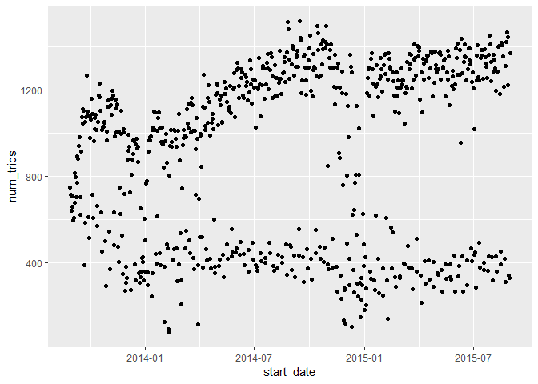

``` r
# Feature Engineering
num_riders <- num_riders %>% mutate('day'=weekdays(start_date, abbreviate=TRUE))
ggplot(num_riders, aes(day, num_trips)) +
  geom_bar(stat='identity')
```

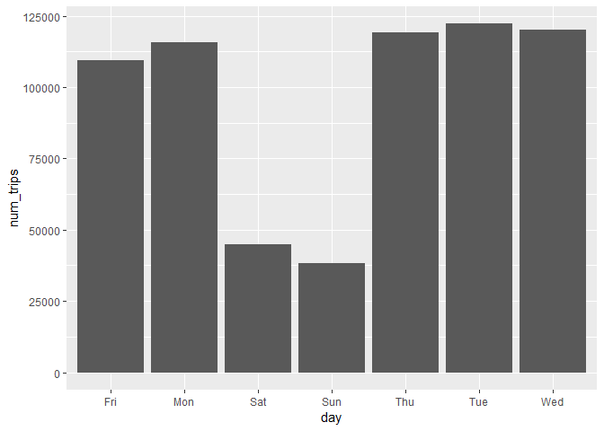

``` r
# Reset factors to be in day order
num_riders$day <- factor(num_riders$day, levels=c('Mon', 'Tue', 'Wed', 'Thu', 'Fri', 'Sat', 'Sun'))
ggplot(num_riders, aes(day, num_trips)) +
  geom_bar(stat='identity')
```

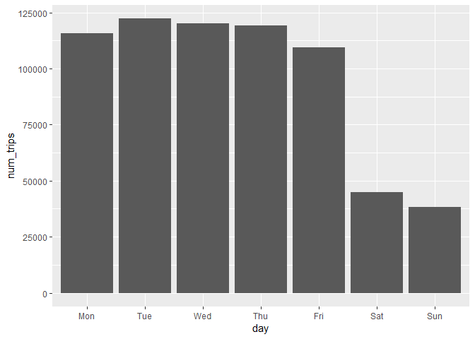

``` r
num_riders <- num_riders %>% mutate('weekend'=(day == 'Sat' | day == 'Sun'))
ggplot(num_riders, aes(x=start_date, y=num_trips)) +
  geom_point(aes(color = weekend))
```

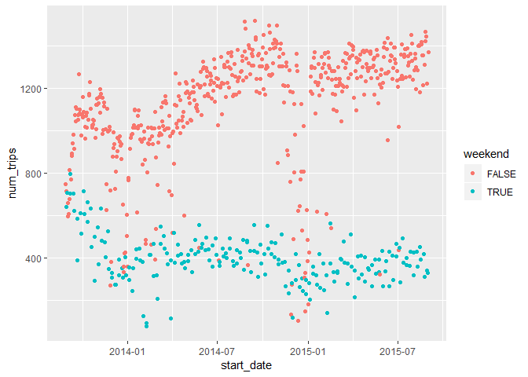

``` r
table(trip$subscription_type)
```

    ## 
    ##   Customer Subscriber 
    ##     103213     566746

``` r
trip_subscriptions <- trip %>% group_by(start_date, subscription_type) %>% summarize(num_trips = n())
trip_subscriptions <- trip_subscriptions %>% mutate('day'=weekdays(start_date, abbreviate=TRUE))
trip_subscriptions$day <- factor(trip_subscriptions$day, levels=c('Mon', 'Tue', 'Wed', 'Thu', 'Fri', 'Sat', 'Sun'))

trip_subscriptions <- trip_subscriptions %>% 
  mutate('weekend'=(day == 'Sat' | day == 'Sun'))

ggplot(trip_subscriptions, aes(x=day, y=num_trips)) +
  geom_bar(stat='identity') +
  facet_grid(subscription_type ~ .)
```

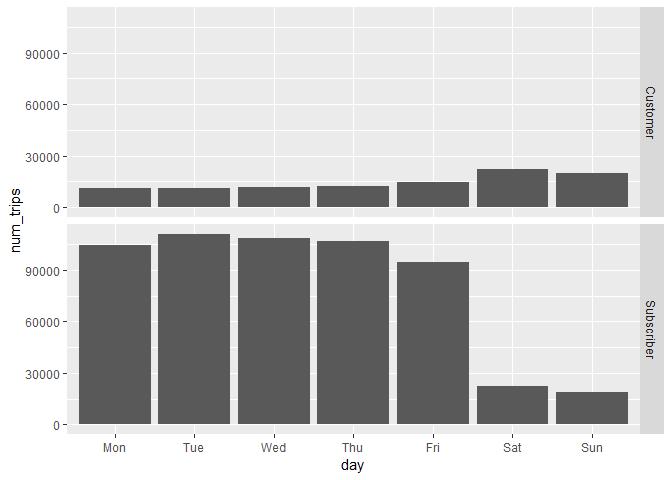

``` r
# Try the above first, then realize that something's up lol
# trip_subscriptions <- trip_subscriptions %>% ungroup()

ggplot(trip_subscriptions, aes(x=day, y=num_trips)) +
  geom_bar(stat='identity') +
  facet_grid(subscription_type ~ .)
```


``` r
start_time <- strsplit(trip$start_time, ':')
convert_time <- function(obs){
  split_time <- strsplit(obs, ':')[[1]]
  hour <- as.integer(split_time[1])
  min <- as.integer(split_time[2])
  
  return(hour + min/60)
}
# Realize that the below line does not work
trip$start_time <- sapply(trip$start_time, convert_time)

ggplot(trip, aes(start_time)) +
  geom_histogram() +
  geom_vline(xintercept=9, color='red') +
  geom_vline(xintercept=17, color='red')
```

    ## `stat_bin()` using `bins = 30`. Pick better value with `binwidth`.

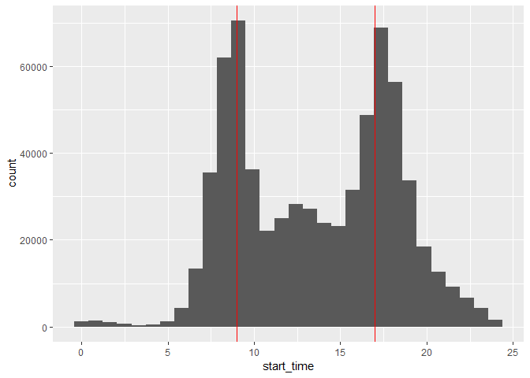

``` r
trip <- trip %>% mutate('duration'=duration/60)
ggplot(trip, aes(duration)) +
  geom_histogram()
```

    ## `stat_bin()` using `bins = 30`. Pick better value with `binwidth`.

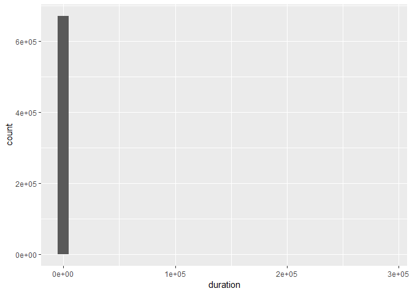

``` r
summary(trip$duration)
```

    ##      Min.   1st Qu.    Median      Mean   3rd Qu.      Max. 
    ##      1.00      5.73      8.62     18.47     12.58 287840.00

``` r
dim(trip %>% filter(duration > 24*60))
```

    ## [1] 296  13

``` r
trip_reasonable <- trip %>% filter(duration < 24*60)
ggplot(trip_reasonable, aes(duration)) +
  geom_histogram()
```

    ## `stat_bin()` using `bins = 30`. Pick better value with `binwidth`.

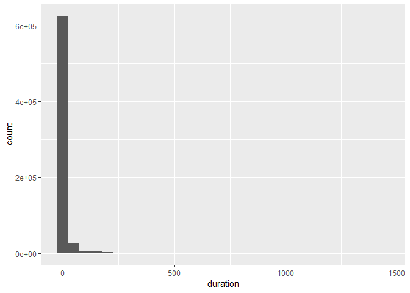

``` r
trip_reasonable <- trip %>% filter(duration < 4*60)
ggplot(trip_reasonable, aes(duration)) +
  geom_histogram()
```

    ## `stat_bin()` using `bins = 30`. Pick better value with `binwidth`.

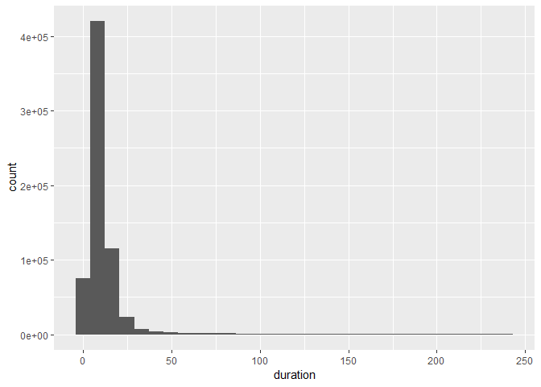

``` r
trip_reasonable <- trip %>% filter(duration < 1*60)
ggplot(trip_reasonable, aes(duration)) +
  geom_histogram()
```

    ## `stat_bin()` using `bins = 30`. Pick better value with `binwidth`.

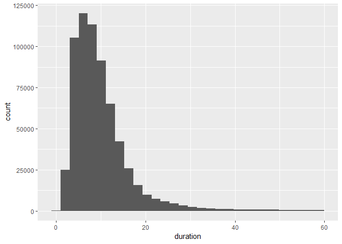

``` r
trip$bike_id <- as.factor(trip$bike_id)
station_cities <- station[c('id', 'name', 'city')]
trip <- left_join(trip, station_cities, by=c('start_station_id' = 'id'))

trip_cities <- trip %>% group_by(start_date, city) %>% summarize('num_trips'=n())
trip_cities <- ungroup(trip_cities)
ggplot(trip_cities, aes(start_date, num_trips)) +
  geom_point() + 
  facet_grid(city ~ .)
```

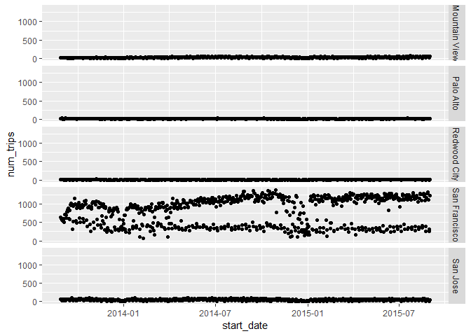
